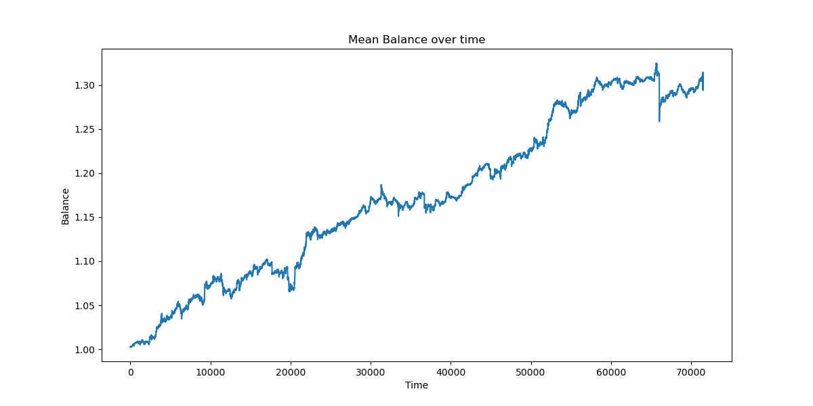

# Time-based Seasonality Backtest

## Overview
This repository contains a backtest designed to investigate the seasonality effects at different time frames: minute, hour, and day-of-the-week, for over 100 different cryptocurrency symbols. The strategy will adjust its position every 5 minutes based on three distinct criteria to determine the presence of any time-based seasonality patterns.

## Dataset
- **Type**: Cryptocurrency Data
- **Location**: `/my/data/path/{symbol}.feather`
- `{symbol}` represents the different cryptocurrency symbols for which the backtest will be conducted.

## Trading Criteria

### 1. Minute-based Seasonality
- Long $10: Current minute is one of [5, 20, 35, 50].
- Short $10: Current minute is one of [0, 10, 25, 40].

### 2. Hour-based Seasonality
- Long $10: Current hour is one of [2, 9, 19].
- Short $10: Current hour is one of [0, 5, 12].

### 3. Day-of-the-week Seasonality
- Long $10: Monday or Thursday.
- Short $10: Tuesday or Sunday.

## Execution
1. Clone the repository.
2. Ensure the data is placed in the appropriate path as mentioned in the **Dataset** section.
3. Run the backtest script.

## Results
- Mean CAGR = 45.54%, SR = 122.11, MDD = 6.65%

Additionally, it plots the balance list for each symbol to visually inspect the impact of the seasonality effect on the returns.
